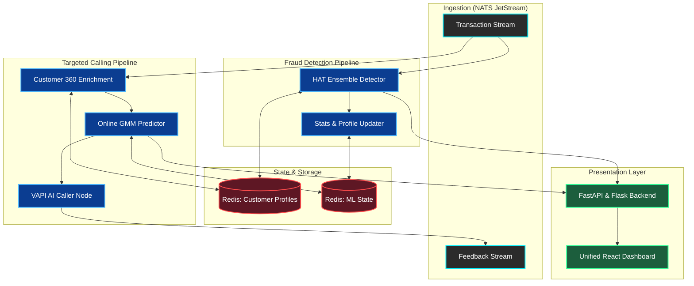
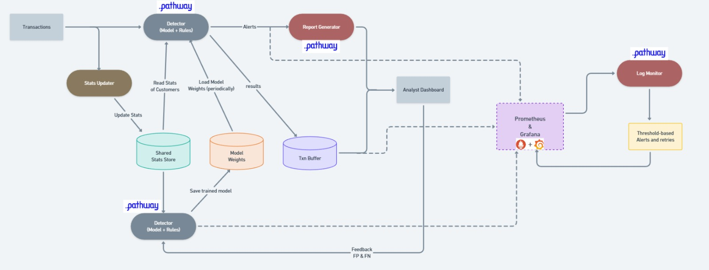

<p align="center">
  <h1 align="center"> FLOW: Fraud and load optimization workbench</h1>
  <p align="center">
    <strong>A production-grade, streaming data platform for real-time fraud detection and intelligent customer targeting in banking</strong>
  </p>
  <p align="center">
    <em>Built with Pathway · NATS JetStream · Online ML · Docker · React</em>
  </p>

<p align="center">
  <a href="https://pathway.com/"></a>
  <a href="https://nats.io/"></a>
  <a href="https://redis.io/"></a>
  <a href="https://riverml.xyz/"></a>
  <a href="https://reactjs.org/"></a>
</p>

  <p align="center">
    <a href="#-fraud-detection-pipeline">Fraud Detection</a> · 
    <a href="#-targeted-calling-pipeline">Targeted Calling</a> · 
    <a href="#-quick-start">Quick Start</a> · 
    <a href="#-architecture">Architecture</a> · 
    <a href="#-monitoring--observability">Monitoring</a>
  </p>
</p>

---

## 📌 Summary

This repository contains a **unified real-time banking analytics platform** composed of two independent, fully containerized streaming pipelines:

| Pipeline | Purpose | Core ML Technique | Key Output |
|---|---|---|---|
| **[Fraud Detection](https://github.com/Meh-Mehul/Fraud-Detection-Pipeline)** | Real-time loan fraud detection with sub-5ms latency | Hoeffding Adaptive Tree ensemble (online learning via [River](https://riverml.xyz/)) | Tiered fraud alerts, PDF investigation reports |
| **[Targeted Calling](./Targeted-Calling/)** | Intelligent lead scoring and product recommendation for banking products | Online Gaussian Mixture Model (custom implementation) | Qualified leads, AI-generated call transcripts, cluster-level PDF reports |

Both pipelines ingest streaming transaction data via **NATS JetStream**, process it through **Pathway** dataflow graphs, maintain state in **Redis**, and expose production-grade **Prometheus + Grafana** dashboards — all orchestrated through Docker Compose with a single-command deployment.

> **Note**: This project was originally built for **Inter IIT Tech Meet 14.0** (High Prep Pathway Problem Statement).

---

## ✨ Key Highlights

- **End-to-End Streaming Architecture** — No batch jobs. Transactions are processed in real time from ingestion to alert/recommendation with millisecond-level latency.
- **Online Machine Learning** — Models continuously learn from feedback without retraining on full datasets. The Fraud Detection pipeline uses Hoeffding Adaptive Trees; the Targeted Calling pipeline uses a custom Online GMM with incremental cluster updates.
- **Human-in-the-Loop Feedback** — Both pipelines support closed-loop learning: fraud analysts can confirm/reject alerts, and customer call outcomes feed back into the GMM model.
- **Production-Grade Observability** — Prometheus metrics, Grafana dashboards, alerting rules, and health checks on every component.
- **Fully Containerized** — 15+ Docker containers across two isolated networks with automated orchestration scripts.
- **AI-Powered Interactions** — VAPI-based automated customer calls with GPT-4 generated scripts, call transcript analysis via OpenAI, and LLM-powered financial product recommendation reports.

---


## 🏗 Architecture

<div align="center">
  
  <br/>
  <em>Combined Pipeline Architecture showing both Fraud Detection and Targeted Calling</em>
</div>

<br>

### 🌊 Data Flow Pipeline



<br>

### 🔍 Detailed Pipeline Views

<div align="center">
  
  
</div>


---

## 🛡 Fraud Detection Pipeline

> **[Full Documentation →](https://github.com/Meh-Mehul/Fraud-Detection-Pipeline)**

### Overview

A **real-time fraud detection system** that processes streaming loan transactions and flags suspicious activity with sub-5ms latency. The system uses a hybrid approach combining online ML models with a configurable rule engine.

### ML Approach — Hoeffding Adaptive Tree Ensemble

The detector uses an **ensemble of two Hoeffding Adaptive Tree classifiers** (from the [River](https://riverml.xyz/) online learning library), which natively handle concept drift and learn incrementally from each labeled transaction:

```
ML Score = (HAT_main.predict_proba[fraud] + HAT_validator.predict_proba[fraud]) / 2 × 100

Alert Tiers:
  Tier 1 (Critical) → Rule match OR ML Score ≥ 80%
  Tier 2 (High)     → ML Score ≥ 50%
  Tier 3 (Medium)   → ML Score ≥ 30%
```

**Feature Engineering** — 12 features combining raw transaction attributes with real-time statistical profiles:

| Feature | Description | Source |
|---|---|---|
| `amt`, `z_amt`, `amt_ratio` | Transaction amount, Z-score normalized, ratio to average | Transaction + Redis customer profile |
| `dist`, `z_dist` | Haversine distance to merchant, normalized | Transaction coordinates |
| `merch_risk`, `cat_risk` | Merchant and category historical fraud rates | Redis merchant/category profiles |
| `late_night`, `online` | Binary flags for high-risk temporal and categorical patterns | Rule engine configuration |
| `fraud_history`, `n` | Customer's historical fraud count and total transactions | Redis customer profile |

### Pipeline Nodes

| Node | Role | Streaming Framework |
|---|---|---|
| **Publisher** | Streams transactions from CSV to NATS with timestamps for latency tracking | Python + NATS |
| **Detector** | Real-time fraud inference (ML + rules), emits alerts and results | Pathway |
| **Stats Updater** | Updates Redis customer/merchant/category profiles from results | Pathway |
| **Feedback Writer** | Receives confirmed fraud labels, performs online model training | Pathway |
| **Report Generator** | Generates PDF investigation reports for each alert | Pathway |
| **Negative Collector** | Collects non-alerted transactions for false-negative review | Pathway |
| **Frontend** | FastAPI web UI for fraud investigation and feedback submission | FastAPI + Jinja2 |

### Performance

| Metric | Value |
|---|---|
| **End-to-end latency** | 1–5 ms (p50) |
| **Throughput** | 25+ TPS sustained |
| **F1 Score** | ~85–90% after warm-up |
| **Dataset** | [Kaggle Credit Card Fraud](https://www.kaggle.com/datasets/kartik2112/fraud-detection) (~1.3M transactions) |

---

## 🎯 Targeted Calling Pipeline

> **[Full Documentation →](./Targeted-Calling/README.md)**

### Overview

An **intelligent lead scoring and customer targeting platform** that identifies banking customers eligible for financial products (Car Loan, Home Loan, Nifty50 SIP, ELSS) and orchestrates automated outreach — all in real time as new transactions stream in.

### ML Approach — Online Gaussian Mixture Model

The core ML engine is a **custom Online GMM** (`onlineGMMv1`) that clusters customers in a mixed numerical-categorical feature space and incrementally updates clusters via feedback:

- **Positive reinforcement (TP)**: Move cluster mean toward the data point, update covariance and categorical probabilities
- **False positive penalization (FP)**: Reduce cluster weight via negative learning rate
- **Missed opportunity learning (FN)**: Buffer false negatives, periodically fit new sub-clusters via BIC-optimal GMM
- **Cluster lifecycle management**: Automatic pruning of idle/low-weight clusters, merging of overlapping clusters (Bhattacharyya distance)
- **Exemplar tracking**: Each cluster maintains an LRU cache of representative customer IDs for explainability

**Scoring** uses Mahalanobis distance thresholding (via χ² critical value) combined with log-probability for categorical features.

### Pipeline Architecture

```
Streaming Transactions ──► Data Updater (Customer 360 Enrichment)
                                    │
                                    ▼
                           Lead Dispatcher (Business Rules)
                           ┌───────┼───────┬────────┐
                           ▼       ▼       ▼        ▼
                     Car Loan  Home Loan  Nifty50   ELSS
                     Predictor                    (Future)
                           │
                           ▼
                    GMM Prediction ──► Oracle (Rules Ground-Truth)
                           │                    │
                           ▼                    ▼
                    VAPI Caller Node     Feedback Classification
                    (AI Phone Calls)         (TP/FP/TN/FN)
                           │                    │
                           ▼                    ▼
                    Call Transcripts      Feedback Node
                    (GPT-4 Analysis)     (Online GMM Update)
                           │                    │
                           └──────────┬─────────┘
                                      ▼
                           Backend API + React Dashboard
```

### Key Components

| Component | Description | Key Technology |
|---|---|---|
| **Data Updater** | Real-time Customer 360 enrichment — joins streaming transactions with master customer profiles, recalculates credit scores, spending ratios, and category-level metrics | Pathway (stateful join + aggregation) |
| **Lead Dispatcher** | Applies product-specific business rules (volume thresholds, cooldown periods) to dispatch qualified leads to NATS topics | Pathway |
| **GMM Predictor** | Runs Online GMM inference on enriched customer features, outputs cluster assignment and eligibility prediction | Pathway + Custom `onlineGMMv1` |
| **Oracle** | Rules-based ground-truth predictor (replicates data generation logic) that classifies predictions as TP/FP/TN/FN | Pathway |
| **Feedback Node** | Batched model updates — receives TP/FP/TN/FN feedback strings, updates GMM clusters, and persists model to disk | Pathway |
| **Caller Node** | Automated customer outreach via VAPI — generates dynamic GPT-4 call scripts, initiates phone calls, and collects transcripts | VAPI + OpenAI GPT-4 |
| **Report Generator** | LLM-powered financial product recommendation reports with scheme pre-screening, PDF generation, and NATS publishing | OpenAI GPT-4 + ReportLab |
| **Backend API** | Flask REST API with WebSocket support (Socket.IO) for real-time dashboard updates, call log analytics, and report serving | Flask + SQLite |
| **React Dashboard** | Professional bank employee dashboard with cluster reports, AI call logs, model statistics, and PDF viewer | React + TypeScript + Vite + Recharts |

### Products Targeted

| Product | Volume Threshold | Cooldown | ML Model |
|---|---|---|---|
| **Car Loan** | 50,000 | 45 days | Online GMM (active) |
| **Home Loan** | 100,000 | 90 days | Online GMM (active) |
| **Nifty50 SIP** | 25,000 | 30 days | Online GMM (active) |
| **ELSS** | 40,000 | 60 days | Online GMM (active) |

---

## 🛠 Technology Stack

### Core Infrastructure

| Technology | Role | Version |
|---|---|---|
| **[Pathway](https://pathway.com/)** | Streaming dataflow framework — real-time joins, aggregations, UDFs | ≥ 0.18.0 |
| **[NATS JetStream](https://nats.io/)** | High-performance message broker — pub/sub with persistence | 2.10 |
| **[Redis](https://redis.io/)** | In-memory state store — customer profiles, model data, statistics | 7 (Alpine) |
| **[Docker Compose](https://docs.docker.com/compose/)** | Container orchestration — isolated networks, health checks | v2 |

### Machine Learning

| Technology | Role | Pipeline |
|---|---|---|
| **[River](https://riverml.xyz/)** | Online learning — Hoeffding Adaptive Trees, StandardScaler | Fraud Detection |
| **scikit-learn** | Batch GMM initialization, preprocessing (StandardScaler, OrdinalEncoder) | Targeted Calling |
| **NumPy / SciPy** | Mahalanobis distance, chi-squared thresholding, matrix operations | Targeted Calling |
| **Custom `onlineGMMv1`** | Streaming GMM with cluster lifecycle management (merge, prune, exemplar tracking) | Targeted Calling |

### AI / LLM Integration

| Technology | Role |
|---|---|
| **OpenAI GPT-4 / GPT-4o-mini** | Call script generation, transcript analysis, financial report reasoning |
| **VAPI** | Automated phone calls — voice AI with Deepgram TTS, call recording |
| **Pathway xpack-llm** | LLM integration within Pathway dataflow graphs |

### Web / Frontend

| Technology | Role |
|---|---|
| **FastAPI + Jinja2** | Fraud Detection frontend (investigation UI) |
| **Flask + Flask-SocketIO** | Targeted Calling backend API (REST + WebSocket) |
| **React 18 + TypeScript** | Unified dashboard (Vite, Recharts, Radix UI, React Router) |

### Monitoring

| Technology | Role |
|---|---|
| **Prometheus** | Metrics collection — custom gauges, histograms, counters per node |
| **Grafana** | Dashboard visualization — pre-provisioned with auto-refreshing panels |
| **psutil** | System resource monitoring (memory, CPU) |

---

## 🚀 Quick Start

### Prerequisites

- **Docker & Docker Compose** (v2+)
- **Node.js 18+** (for the React frontend)
- **8 GB+ RAM** recommended (both pipelines run 15+ containers)

### One-Command Deployment

```bash
# Clone the repository
git clone <repo-url>
cd <repo-name>

# Start both pipelines + frontend
./start_all.sh

# Quick restart (skip preprocessing, use existing models)
./restart_all.sh

# Stop everything
./stop_all.sh
```

### Individual Pipeline Control

```bash
# Fraud Detection
cd Fraud-Detection
./pipeline.sh start      # Full start (pretrain + deploy)
./pipeline.sh restart    # Quick restart (reuse model)
./pipeline.sh stop
./pipeline.sh status
./pipeline.sh logs

# Targeted Calling
cd Targeted-Calling
./pipeline.sh start      # Full start (dataset gen + training + deploy)
./pipeline.sh restart    # Quick restart (reuse model)
./pipeline.sh stop
./pipeline.sh status
./pipeline.sh logs
```

---

## 🌐 Access Points

After starting, access the following endpoints:

### Dashboards

| Service | URL | Credentials |
|---|---|---|
| **Unified React Dashboard** | [http://localhost:5173](http://localhost:5173) | — |
| **Grafana (Fraud)** | [http://localhost:3000](http://localhost:3000) | admin / admin |
| **Grafana (Targeting)** | [http://localhost:3001](http://localhost:3001) | admin / admin |

### APIs & Services

| Service | URL | Pipeline |
|---|---|---|
| **Fraud Detection Frontend** | [http://localhost:8000](http://localhost:8000) | Fraud Detection |
| **Targeted Calling Backend** | [http://localhost:5001](http://localhost:5001) | Targeted Calling |
| **Prometheus (Fraud)** | [http://localhost:9090](http://localhost:9090) | Fraud Detection |
| **Prometheus (Targeting)** | [http://localhost:9095](http://localhost:9095) | Targeted Calling |

### Infrastructure

| Service | Fraud Detection | Targeted Calling |
|---|---|---|
| **Redis** | localhost:6379 | localhost:6380 |
| **NATS** | localhost:4222 | localhost:4223 |
| **NATS Monitor** | localhost:8222 | localhost:8223 |

---

## 📊 Monitoring & Observability

Both pipelines ship with **pre-configured Grafana dashboards** that are auto-provisioned on startup.

### Fraud Detection Dashboard

| Panel | Metrics |
|---|---|
| **Model Performance** | F1 Score, Precision, Recall (real-time) |
| **Latency Tracking** | Publisher → Detector, ML inference, end-to-end (p50, p95) |
| **Alert Rates** | Fraud alerts/min by tier (Critical, High, Medium) |
| **Throughput** | Transactions processed/sec |
| **Component Health** | Container status, Redis connectivity |

### Targeted Calling Dashboard

| Panel | Metrics |
|---|---|
| **Enrichment Pipeline** | Transaction volume, master match rate, high-value events |
| **ML Model** | GMM cluster count, component evolution, weight updates |
| **Feedback Loop** | TP/FP/TN/FN rates, batch processing times, buffer sizes |
| **Lead Generation** | Qualified leads/min by product category |
| **System Health** | Memory usage, NATS queue depth, component uptime |

### Alert Rules

Both pipelines include Prometheus alert rules for:
- Component downtime (> 2 min)
- High error rates (> 5%)
- Queue depth anomalies
- Memory pressure
- Model staleness (no updates for > 30 min)

---

## 📁 Repository Structure

```
.
├── start_all.sh                    # Master orchestrator — starts both pipelines + frontend
├── stop_all.sh                     # Gracefully stops all containers and processes
├── restart_all.sh                  # Quick restart (skip preprocessing)
├── requirements.txt                # Unified Python dependencies
│
├── Fraud-Detection/                # 🛡 Real-time fraud detection pipeline
│   ├── pipeline.sh                 #    Pipeline orchestrator (start/stop/restart/status/logs)
│   ├── pretrain.py                 #    Model pretraining on historical data (~12K samples)
│   ├── redis_manager.py            #    Redis stats management CLI
│   ├── detector/                   #    Fraud detector node (Pathway) + stats updater
│   ├── feedback/                   #    Online model training + false negative collector
│   ├── publisher/                  #    Transaction & feedback stream publishers
│   ├── report/                     #    PDF report generator (Pathway + ReportLab)
│   ├── frontend/                   #    FastAPI web UI for fraud investigation
│   ├── shared/                     #    Shared modules (models, stats, metrics, rules)
│   ├── docker/                     #    Dockerfiles + docker-compose
│   ├── monitoring/                 #    Grafana dashboards + Prometheus configs
│   └── README.md                   #    Detailed fraud detection documentation
│
├── Targeted-Calling/               # 🎯 Intelligent customer targeting pipeline
│   ├── pipeline.sh                 #    Pipeline orchestrator
│   ├── dataUpdater/                #    Customer 360 enrichment node (Pathway)
│   ├── leadPublisher/              #    Lead dispatcher with business rules (Pathway)
│   ├── carLoanPredictor/           #    GMM prediction node + VAPI caller
│   ├── carLoanFeedback/            #    Online GMM feedback processor
│   ├── oracle/                     #    Rules-based ground-truth oracle
│   ├── transactionPublisher/       #    Transaction stream publisher
│   ├── models/                     #    Custom Online GMM implementation (onlineGMMv1)
│   ├── datasetGeneration/          #    Synthetic data generation (8 customer archetypes)
│   ├── dataManager/                #    Redis data manager + CSV loader
│   ├── persistenceUtils/           #    Model serialization utilities
│   ├── pipelineConfigs/            #    ML feature configurations per product
│   ├── modelVisualiser/            #    Cluster visualization & GIF generation
│   ├── report_gen/                 #    LLM-powered report generator (GPT-4)
│   ├── accuracyMetrics/            #    Experiment tracking (5 iterations)
│   ├── monitoring/                 #    Prometheus + Grafana + alert rules
│   ├── Backend/                    #    Flask REST API + WebSocket server
│   ├── Frontend/                   #    React + TypeScript dashboard (Vite)
│   ├── docker/                     #    Dockerfiles + docker-compose
│   ├── Persistence/                #    Trained model artifacts (JSON)
│   └── README.md                   #    Detailed targeted calling documentation
│
├── Explaination_arch.mp4           # Architecture explanation video
└── demo.mp4                        # Full demo video
```

---

## ⚙️ Configuration

### Environment Variables

Both pipelines use environment variables for Docker/local compatibility:

| Variable | Default | Description |
|---|---|---|
| `REDIS_HOST` | `localhost` | Redis server hostname |
| `REDIS_PORT` | `6379` / `6380` | Redis server port (per pipeline) |
| `NATS_URI` | `nats://localhost:4222` | NATS server URI |
| `REDIS_DB` | `0` / `1` | Redis database index |
| `OPENAI_API_KEY` | (set in code) | OpenAI API key for report generation |

### Port Allocation

Both pipelines run simultaneously with zero port conflicts:

| Service | Fraud Detection | Targeted Calling |
|---|---|---|
| Redis | 6379 | 6380 |
| NATS | 4222 | 4223 |
| NATS Monitor | 8222 | 8223 |
| Grafana | 3000 | 3001 |
| Prometheus | 9090 | 9095 |
| Frontend/Backend | 8000 | 5001 |
| Metrics (Detector) | 8001 | 8002 |

---

## 🔧 Development

### Running Without Docker

```bash
# 1. Install Python dependencies
pip install -r requirements.txt

# 2. Start infrastructure only (via Docker)
cd Fraud-Detection
docker-compose -f docker/docker-compose-full.yml up redis nats prometheus grafana -d

# 3. Run individual components in separate terminals
python pretrain.py
python redis_manager.py load
python -c "from detector.detector_ronly import run_detector; run_detector()"
python -c "from feedback.feedback_writer import run_feedback_writer; run_feedback_writer()"
python publisher/pub_common.py
python frontend/main.py
```

### Frontend Development

```bash
cd Targeted-Calling/Frontend
npm install
npm run dev    # → http://localhost:5173
```

### Adding Dependencies

1. Add to the respective `requirements-docker.txt`
2. Rebuild images: `docker-compose build --no-cache`

---

## 🔍 Troubleshooting

<details>
<summary><strong>Containers not starting</strong></summary>

```bash
docker ps -a                              # Check container status
docker logs <container-name>              # View specific container logs
docker-compose -p <project> -f docker/docker-compose-full.yml build --no-cache
```
</details>

<details>
<summary><strong>Port conflicts</strong></summary>

```bash
lsof -i :<port>    # Find process using the port
kill -9 <PID>      # Kill the conflicting process
```
</details>

<details>
<summary><strong>Redis connection issues</strong></summary>

```bash
docker exec fraud-redis redis-cli ping
docker exec targeting-redis redis-cli ping
```
</details>

<details>
<summary><strong>Clean restart</strong></summary>

```bash
docker stop $(docker ps -aq)
docker rm $(docker ps -aq)
docker network prune -f
docker volume prune -f
./start_all.sh
```
</details>

---

## 📈 Results & Metrics

### Fraud Detection

| Metric | Value |
|---|---|
| Pre-training F1 Score | ~85–90% |
| Detection Latency (p50) | 1–5 ms |
| Sustained Throughput | 25+ TPS |
| False Positive Rate | < 15% after warm-up |
| Online Learning | Continuous (per-feedback update) |

### Targeted Calling

| Metric | Value |
|---|---|
| Customer Enrichment | Real-time (100ms autocommit) |
| Lead Qualification | 4 products, rules-based dispatch |
| GMM Cluster Adaptation | Batch updates (every 20 feedbacks) |
| Oracle Accuracy | Tracks TP/FP/TN/FN rates live |
| Report Generation | GPT-4 powered PDF reports |

---

## 📄 License

MIT License. See individual pipeline directories for component-specific licensing.
